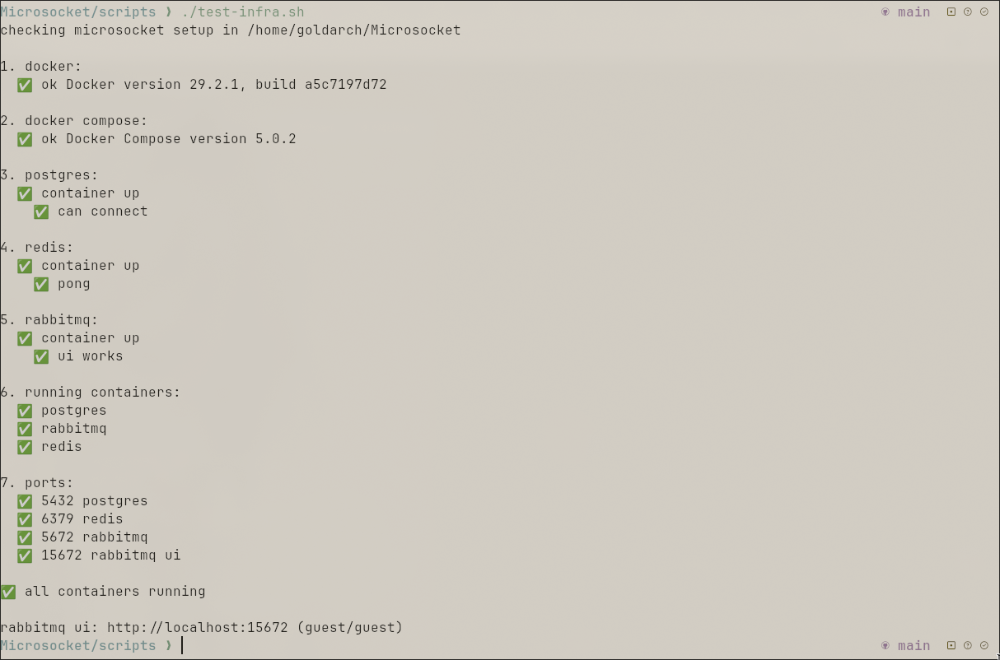
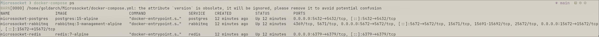
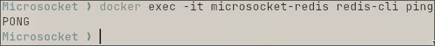
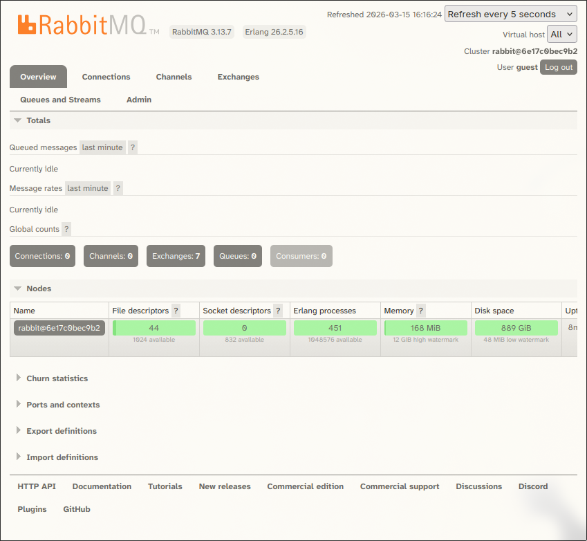

# Microsocket

Real-time messaging app built with microservices.



## What's Working (Week 1)

**Infrastructure:**
- ✅ PostgreSQL running on port 5432
- ✅ Redis running on port 6379  
- ✅ RabbitMQ running on ports 5672 & 15672



**Verified:**
- All containers up
- Databases responding
- Message queue accessible
- Test script passes




## Quick Start

git clone https://github.com/toheheart/Microsocket.git
cd Microsocket
make setup
make test

## Project Structure
```
microsocket/
├── services/     # API services
├── workers/      # Background workers
├── scripts/      # Test scripts
└── screenshots/  # Documentation
```
## Tech

Python, FastAPI, PostgreSQL, Redis, RabbitMQ, Docker

---

*Starting Auth Service next*
